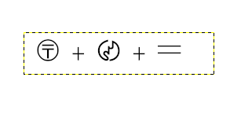

# cjk (Point-94)
## Description
There is a locker protected with a pin.
Can you help me out in finding the pin in the image, and there is some labeling side of it.

https://drive.google.com/file/d/12xHqvBOv5P6S2zjn9oWNTlOMPkgT_aal/view?usp=sharing (link for downloading the image.)

Note : flag is not in SHELL{} format, just a positive number.

## Solution
cjkについて調べてみると以下の[サイト](https://ja.wikipedia.org/wiki/CJK%E3%81%AE%E8%A8%98%E5%8F%B7%E5%8F%8A%E3%81%B3%E5%8F%A5%E8%AA%AD%E7%82%B9)にたどり着いた.
  
与えられたimageによると  
  
値を足しているようなのでそれぞれのunicodeの値を抜き出してそれをフラグとした.  
flag = (U+3036) + (U+3004) + (U+3013)  
     = 9053