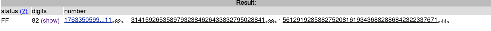

# EASY-RSA

## description 
nとcとeが与えられるのでそこから解読せよ
## Solution
```
n = 1763350599372172240188600248087473321738860115540927328389207609428163138985769311
c =
33475248111421194902497742876885935310304862428980875522333303840565113662943528 
e = 65537
```
だったので、とりあえず[pとqを求めるためにこのサイトに投げる](http://factordb.com/)

```
c = m^e mod n 
m = c^d mod n
```
なのでdを求めたい

さきほどpとqを求めたので
lを求めることが出来る

```
p =  31415926535897932384626433832795028841
q = 56129192858827520816193436882886842322337671 
l = lcm(p-1,q-1)
```

1 < d < lで
e * d mod l = 1なので
eの逆元をmod l で求めてあげればdが求まる

無事材料が揃ったので
m = c^d mod n をして平文を求める
この平文をバイナリにしたらフラグが求まった

### solveコード
```
from Crypto.Util.number import inverse
import math

n = 1763350599372172240188600248087473321738860115540927328389207609428163138985769311
p =  31415926535897932384626433832795028841
q = 56129192858827520816193436882886842322337671
e = 65537
c = 33475248111421194902497742876885935310304862428980875522333303840565113662943528
l = math.lcm(p-1,q-1)

d = inverse(e,l)

m = hex(pow(c,d,n))[2:]

dump = (bytes.fromhex(m)).decode("utf-8")

print(dump)
```

```
mizuiro@mizuiro-arch ~/P/c/S/C/EASY-RSA (main) [127]> python3 solve.py
shell{switchin_to_asymmetric}
```

## 別解
ちなみにこの問題を解くためにあるような[ツール](https://github.com/Ganapati/RsaCtfTool)があるのでぜひ使うと良し！！
```
python3 ~/TOOLS/RsaCtfTool/RsaCtfTool.py -n 1763350599372172240188600248087473321738860115540927328389207609428163138985769311 -e 65537 --uncipher 33475248111421194902497742876885935310304862428980875522333303840565113662943528
private argument is not set, the private key will not be displayed, even if recovered.

[*] Testing key /tmp/tmpslnigcl0.
[*] Performing smallq attack on /tmp/tmpslnigcl0.
[*] Performing fibonacci_gcd attack on /tmp/tmpslnigcl0.
100%|█████████████████████████████████████████████████████████████████████████████████████████| 9999/9999 [00:00<00:00, 258535.45it/s]
[*] Performing pastctfprimes attack on /tmp/tmpslnigcl0.
100%|██████████████████████████████████████████████████████████████████████████████████████████| 113/113 [00:00<00:00, 1966623.87it/s]
[*] Performing system_primes_gcd attack on /tmp/tmpslnigcl0.
100%|████████████████████████████████████████████████████████████████████████████████████████| 7007/7007 [00:00<00:00, 1311328.22it/s]
[*] Performing mersenne_primes attack on /tmp/tmpslnigcl0.
 24%|█████████████████████▉                                                                       | 12/51 [00:00<00:00, 396312.19it/s]
[*] Performing factordb attack on /tmp/tmpslnigcl0.
[*] Attack success with factordb method !

Results for /tmp/tmpslnigcl0:

Unciphered data :
HEX : 0x00000000007368656c6c7b737769746368696e5f746f5f6173796d6d65747269637d
INT (big endian) : 3111388068276188662361997958100924356274395167698926770307665056326525
INT (little endian) : 3716857967501616239523840250653395077772235796196542527851123201402003116282347520
utf-8 : shell{switchin_to_asymmetric}
utf-16 : 猀敨汬獻楷捴楨彮潴慟祳浭瑥楲絣
STR : b'\x00\x00\x00\x00\x00shell{switchin_to_asymmetric}'
```

