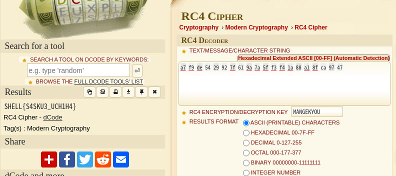

# arc-cipher (Point-116)
## description
cipher_text : a7 f9 de 54 29 92 7f 61 9a 7a 5f f3 f4 1a 88 a1 8f ca 97 47
## Solution
「arc-cipher decode」とググってあげると[良さげなサイト](https://www.dcode.fr/rc4-cipher)があったので、script.pyにあるkeyを指定してencrypt_flagを指定すると
フラグが得られた

